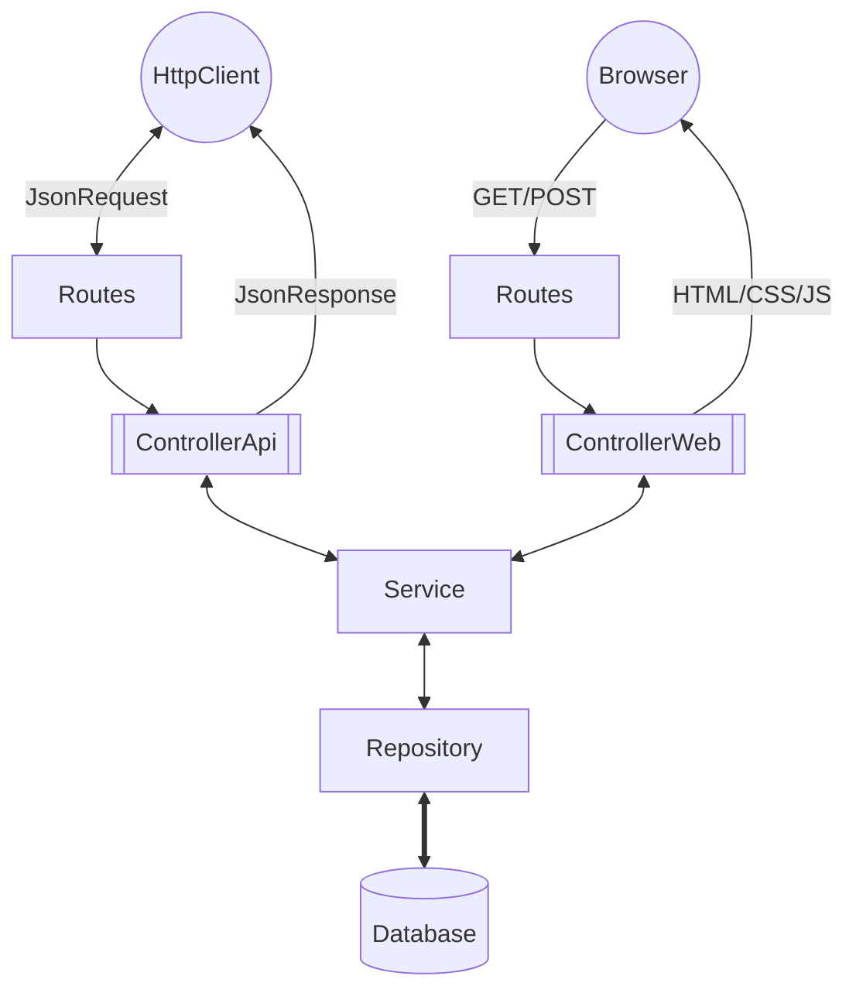

# Estrutura inicial Mapinha CE

Este repositório fornece uma configuração base de aplicação Symfony com Docker, Nginx e PostgreSQL para o projeto Mapa Cultural CE.

A configuração já está dockerizada, então você só precisa ter o Docker Compose rodando na sua máquina para que tudo funcione corretamente.

## Tecnologias

- **PHP** 8.3
- **PostgreSQL** 16
- **MongoDB** 7
- **Symfony** 7
- **Bootstrap/MapaCulturalDesign** 5.3 

[Acesse aqui para entender as decisões](./help/STACK)

## Instalação 
<details>
<summary>Passo a passo</summary>

### Clonar o Repositório

Primeiro, clone o repositório usando SSH ou HTTPS:

```bash
git clone git@github.com:secultce/mapinha.git
```
ou
```bash
git clone https://github.com/secultce/mapinha.git
```

### Navegar para o Diretório do Projeto
Mude para o diretório do projeto:

```bash
cd mapinha
```

### Iniciar os Contêineres Docker
Execute o Docker Compose para iniciar os contêineres:
```bash
docker-compose up -d
```

### Instalar Dependências
Para instalar as dependências do projeto, entre no contêiner PHP:
```bash
docker-compose exec -it mapinha-php bash
```

Dentro do contêiner, execute:
```bash
composer install
```

### Uso

Depois que tudo estiver configurado e as dependências instaladas, você pode acessar sua aplicação Symfony em [http://localhost:8080](http://localhost:8080).

Também criei uma rota de teste. Você pode acessá-la em [http://localhost:8080/hello](http://localhost:8080/hello). Esta rota está definida no controller `HelloWorldController` e retorna a mensagem "Bem vind@ ao Mapas Culturais CE".

</details>


## Desenvolvimento
<details>
<summary>Arquitetura e Decisões técnicas</summary>

Estamos utilizando o Symfony e o seu ecossistma de bibliotecas, porém a arquitetura é baseada em camadas e trata-se de um monolítico com a metodologia API First



- Para saber mais sobre nossas decisões técnicas [acesse aqui](./help/README.md)
- Para entender nosso fluxo de desenvolvimento decisões técnicas [clique aqui](./help/DEV-FLOW.md)
</details>

## Design UI/UX
<details>
<summary>Informações importantes</summary>

### Prototipação das telas
A prototipagem das telas é feita por outro time, do RedeMapas, e se encontra [neste link do Figma](https://www.figma.com/design/HkR1qdfHPn4riffcBBOQwR/Prot%C3%B3tipos-%7C-Prioriza%C3%A7%C3%B5es?node-id=0-1&t=n23kLvhTSbEMELhz-0) 

### Componentes web
Há um fork do Bootstrap (framework css) com a implementação dos protótipos acima, se encontra [neste repositório](https://github.com/secultce/mapaculturaldesign)

### Decisões de Design
Alguns protótipos implementados não estão seguindo a risca o design sugerido, por decisões totalmente técnicas que estão [documentadas aqui](https://github.com/secultce/mapaculturaldesign/blob/main/help/design-decisions.md)
</details>

