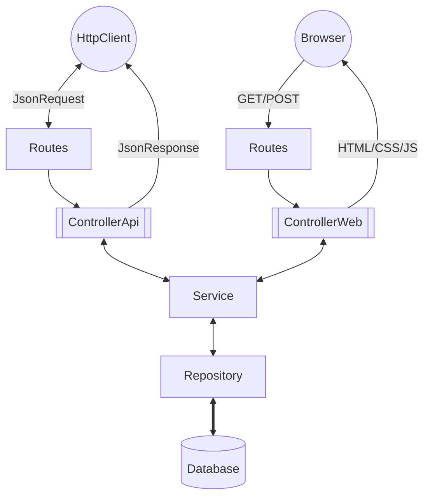

# Estrutura inicial Aurora

Este repositório fornece uma configuração base de aplicação Symfony com Docker, Nginx e PostgreSQL para substituir o projeto Aurora utilizado no Ceará.

A configuração já está dockerizada, então você só precisa ter o Docker Compose rodando na sua máquina para que tudo funcione corretamente.

## Tecnologias

- **PHP** 8.3
- **PostgreSQL** 16
- **MongoDB** 7
- **Symfony** 7
- **Aurora User Interface** 5.3 

[Acesse aqui para entender as decisões](./help/STACK.md)

[Acesse aqui os diagramas](./help/DIAGRAM.md)

## Instalação 
<details>
<summary>Passo a passo</summary>

### Clonar o Repositório

Primeiro, clone o repositório usando SSH ou HTTPS:

```bash
git clone git@github.com:secultce/aurora.git
```
ou
```bash
git clone https://github.com/secultce/aurora.git
```

### Navegar para o Diretório do Projeto
Mude para o diretório do projeto:

```bash
cd aurora
```

---
>
> O jeito mais fácil é rodar o comando `make setup`, isso já vai executar todos os passos necessários e deixar a aplicação rodando em <http://localhost:8080>
>
Mas se preferir, pode fazer o passo a passo abaixo

---

### Iniciar os Contêineres Docker
Execute o Docker Compose para iniciar os contêineres:
```bash
docker compose up -d
```

### Instalar Dependências
Para instalar as dependências do projeto, entre no contêiner PHP:
```bash
docker compose exec -it php bash
```
**Agora é necessário executar alguns passos, nessa ordem, dentro do contêiner:**

1 - Instalação das dependências do PHP:
```bash
composer install
```

2 - Gerar os arquivos de Proxies do MongoDB:
```bash
php bin/console doctrine:mongodb:generate:proxie
```

3 - Executar as migrations do banco de dados
```bash
php bin/console doctrine:migrations:migrate -n
```

4 - Executar as fixtures (dados de teste) do banco de dados
```bash
php bin/console doctrine:fixtures:load -n
```

5 - Instalação das dependêncis do frontend:
```bash
php bin/console importmap:install
```

6 - Compilar os arquivos do frontend
```bash
php bin/console asset-map:compile
```

7 - Gerar as chaves de autenticação
```bash
php bin/console lexik:jwt:generate-keypair
```

### Uso

Depois que tudo estiver configurado e as dependências instaladas, você pode acessar sua aplicação Symfony em [http://localhost:8080](http://localhost:8080).

Há também uma rota de teste para a API. Você pode acessá-la em [http://localhost:8080/api/example](http://localhost:8080/api/example). Esta rota está definida no controller `ExampleController` e retorna a mensagem de sucesso.

</details>


## Desenvolvimento
<details>
<summary>Arquitetura e Decisões técnicas</summary>

Estamos utilizando o Symfony e o seu ecossistma de bibliotecas, porém a arquitetura é baseada em camadas e trata-se de um monolítico com a metodologia API First



- Para saber mais sobre nossas decisões técnicas [acesse aqui](./help/README.md)
- Para entender nosso fluxo de desenvolvimento decisões técnicas [clique aqui](./help/DEV-FLOW.md)
</details>

## Design UI/UX
<details>
<summary>Informações importantes</summary>

### Prototipação das telas
A prototipagem das telas é feita por outro time, do RedeMapas, e se encontra [neste link do Figma](https://www.figma.com/design/HkR1qdfHPn4riffcBBOQwR/Prot%C3%B3tipos-%7C-Prioriza%C3%A7%C3%B5es?node-id=0-1&t=n23kLvhTSbEMELhz-0) 

### Componentes web
Há um fork do Bootstrap (framework css) com a implementação dos protótipos acima, se encontra [neste repositório](https://github.com/secultce/aurora-ui)

### Decisões de Design
Alguns protótipos implementados não estão seguindo a risca o design sugerido, por decisões totalmente técnicas que estão [documentadas aqui](https://github.com/secultce/aurora-ui/blob/main/help/design-decisions.md)
</details>

