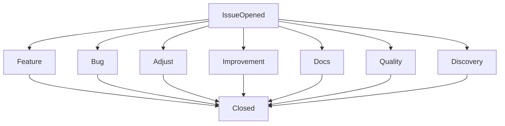
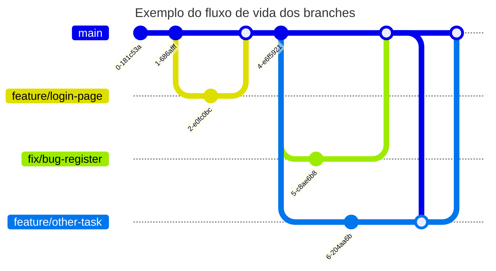
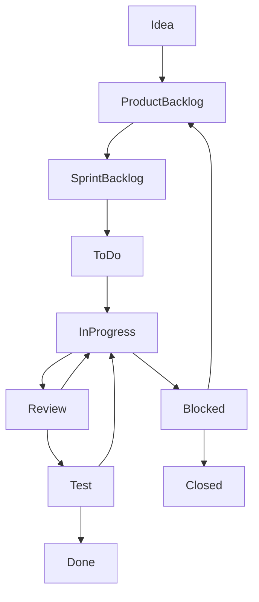

# Fluxo de Desenvolvimento

Todo o desenvolvimento segue um fluxo baseado em Kanban/Scrum/Agile que segue uma sequência lógica para resolução de um **problema** ou implementação de uma nova **funcionalidade**

## Issues

Cada tipo de issue define o tipo de implementação a ser feita no código

- **Feature:** Novas funcionalidades, normalmente algo que ainda não existe na aplicação
- **Bug:** Problema a ser resolvido, que muito provavelmente impossibilita e/ou atrapalha a execução de alguma ação
- **Adjust:** Pequenas modificações que não chegam a ser nova funcionalidade, por exemplo, alterar a cor de algo
- **Improvement:** Melhoria significativa em alguma funcionalidade já existente, por exemplo, melhorar uma validação de um formulário
- **Quality:** Tarefas que envolvem a qualidade do código, normalmente algumra refatoração
- **Discovery:** Dificilmente envolvem código, mas sim, levantamento de informações sobre alguma biblioteca e/ou abordagem técnica a ser utilizada, por exemplo, uso da autenticação com GovBr
- **Docs:** Tarefas que envolvem criação e/ou melhoria exclusivamente da documentação, como a criação deste fluxo

> Para abrir uma nova issue, [clique aqui](https://github.com/secultce/aurora/issues/new)

--- 

## Branches

> O branch principal (produção), é o `main`, ele não é atualizado constantemente, e toda e qualquer alteração deve ser feita através de pull requests vindos diretamente da branch `develop`

> Para abrir um novo Pull Request, [leia aqui](./CREATE-PULL-REQUESTS.md)

## Sprints

### Tarefas (Issues/Tasks)

Internamente a equipe se autogerencia seguindo as boas práticas da metodologia SCRUM e do desenvolvimento ágil, escolhendo, de acordo com suas habilidades e disponibilidades aquelas issues que fazem sentido e são possíveis de serem implementadas:

- **Idea:** é um status de uma issue ainda em criação e/ou rascunho, ao ser finalizada a mesma é automaticamente entendida como "Product Backlog"
- **Product Backlog:** Basicamente significa que isso deve ser entregue, não sabe-se certo quando, mas precisa ser entregue em algum momento
- **Sprint Backlog:** Deve ser entregue nas duas próximas semanas (ou na semana corrente)
- **ToDo:** Já possui alguém (auto) definido para essa task, e essa pessoa já está atrás das informações necessárias para a mesma 
- **InProgress:** O trabalho começou a ser de fato realizado (codificando)
- **Review:** O código está pronto para ser revisado por outras pessoas do time
- **Test:** O código já foi revisado e precisa ser testado no ambiente de homologação
- **Done** O código já foi revisado e precisa ser testado no ambiente de homologação
- **Closes:** O código já foi revisado e precisa ser testado no ambiente de homologação

### Prioridades (Priority)
<table>
    <thead>
        <tr><th>Prioridade</th><th>Descrição</th></tr>
    </thead>    
    <tbody>
        <tr>
            <td style="color: #b82e2e">Very High</td><td>Tarefa de prioridade máxima, provavelmente um bug</td>
        </tr>
        <tr>
            <td style="color: #b88a2e">High</td><td>Tarefa de prioridade alta, provavelmente algo que não esteja funcionando corretamente</td>
        </tr>
        <tr>
            <td>Medium</td><td>Tarefa normal</td>
        </tr>
        <tr>
            <td style="color: #0d5aa7;">Low</td><td>Tarefa um pouco importante</td>
        </tr>
        <tr>
            <td style="color: #00acee;">Very Low</td><td>Tarefa que não é nem um pouco importante</td>
        </tr>
    </tbody>
</table>

### Peso (Weight)

<table>
    <thead>
        <tr><th>Peso</th><th>Descrição</th></tr>
    </thead>    
    <tbody>
        <tr>
            <td>1</td><td>Tarefa muito simples</td>
        </tr>
        <tr>
            <td>2</td><td>Tarefa simples</td>
        </tr>
        <tr>
            <td>3</td><td>Tarefa mediana</td>
        </tr>
        <tr>
            <td>5</td><td>Tarefa muito complexa</td>
        </tr>
    </tbody>
</table>

seguindo a sequência fibonacci, se uma task tiver tamanho 8 (oito), significa que precisa ser quebrada em duas ou mais 