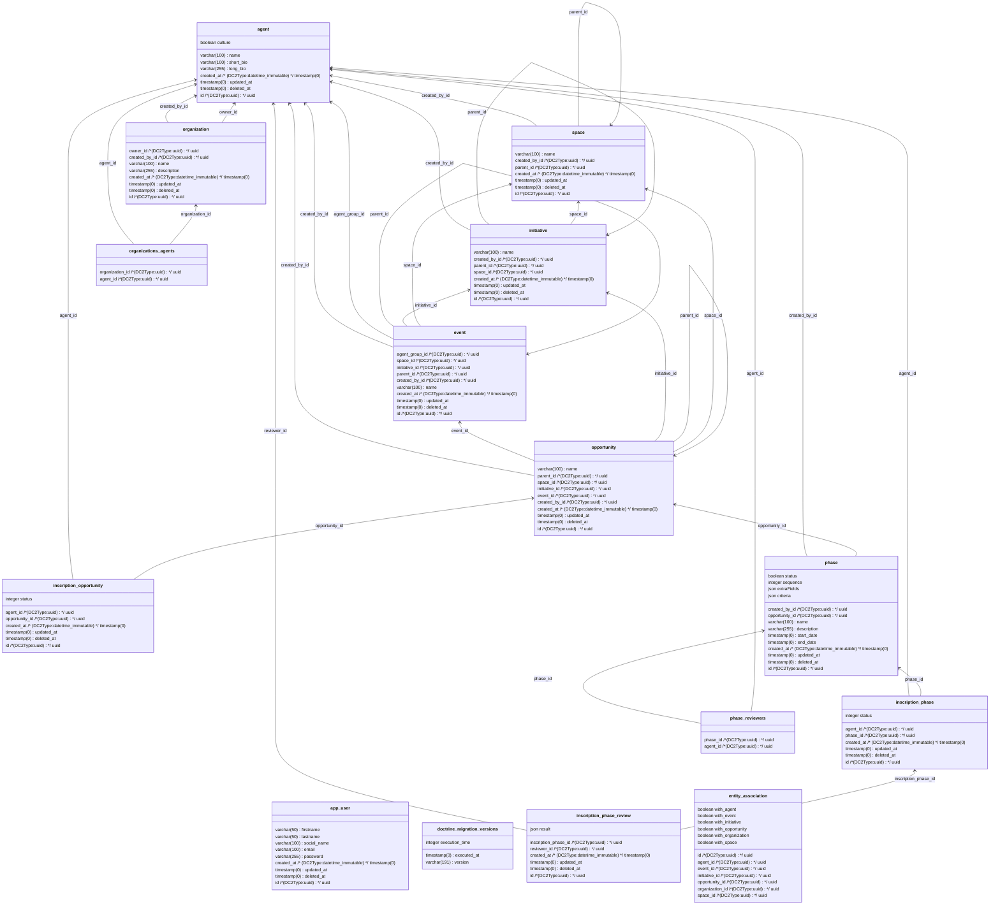
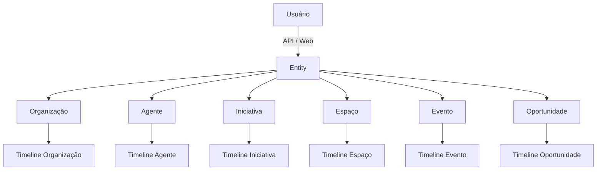

## Diagrama de Entidade Relacionamento

```mermaid
classDiagram
direction BT
    class agent {
       varchar(100) name
       varchar(100) short_bio
       varchar(255) long_bio
       boolean culture
       created_at  /* (DC2Type:datetime_immutable) */ timestamp(0)
       timestamp(0) updated_at
       timestamp(0) deleted_at
       id  /* (DC2Type:uuid) */ uuid
    }
    class app_user {
       varchar(50) firstname
       varchar(50) lastname
       varchar(100) social_name
       varchar(100) email
       varchar(255) password
       created_at  /* (DC2Type:datetime_immutable) */ timestamp(0)
       timestamp(0) updated_at
       timestamp(0) deleted_at
       id  /* (DC2Type:uuid) */ uuid
    }
    class doctrine_migration_versions {
       timestamp(0) executed_at
       integer execution_time
       varchar(191) version
    }
    class event {
       agent_group_id  /* (DC2Type:uuid) */ uuid
       space_id  /* (DC2Type:uuid) */ uuid
       initiative_id  /* (DC2Type:uuid) */ uuid
       parent_id  /* (DC2Type:uuid) */ uuid
       created_by_id  /* (DC2Type:uuid) */ uuid
       varchar(100) name
       created_at  /* (DC2Type:datetime_immutable) */ timestamp(0)
       timestamp(0) updated_at
       timestamp(0) deleted_at
       id  /* (DC2Type:uuid) */ uuid
    }
    class initiative {
       varchar(100) name
       created_by_id  /* (DC2Type:uuid) */ uuid
       parent_id  /* (DC2Type:uuid) */ uuid
       space_id  /* (DC2Type:uuid) */ uuid
       created_at  /* (DC2Type:datetime_immutable) */ timestamp(0)
       timestamp(0) updated_at
       timestamp(0) deleted_at
       id  /* (DC2Type:uuid) */ uuid
    }
    class opportunity {
       varchar(100) name
       parent_id  /* (DC2Type:uuid) */ uuid
       space_id  /* (DC2Type:uuid) */ uuid
       initiative_id  /* (DC2Type:uuid) */ uuid
       event_id  /* (DC2Type:uuid) */ uuid
       created_by_id  /* (DC2Type:uuid) */ uuid
       created_at  /* (DC2Type:datetime_immutable) */ timestamp(0)
       timestamp(0) updated_at
       timestamp(0) deleted_at
       id  /* (DC2Type:uuid) */ uuid
    }
    class inscription_opportunity {
       agent_id  /* (DC2Type:uuid) */ uuid
       opportunity_id  /* (DC2Type:uuid) */ uuid
       integer status
       created_at  /* (DC2Type:datetime_immutable) */ timestamp(0)
       timestamp(0) updated_at
       timestamp(0) deleted_at
       id  /* (DC2Type:uuid) */ uuid
    }
    class phase {
       created_by_id  /* (DC2Type:uuid) */ uuid
       opportunity_id  /* (DC2Type:uuid) */ uuid
       varchar(100) name
       varchar(255) description
       timestamp(0) start_date
       timestamp(0) end_date
       boolean status
       integer sequence
       json extraFields
       json criteria
       created_at  /* (DC2Type:datetime_immutable) */ timestamp(0)
       timestamp(0) updated_at
       timestamp(0) deleted_at
       id  /* (DC2Type:uuid) */ uuid
    }
    class inscription_phase {
       agent_id  /* (DC2Type:uuid) */ uuid
       phase_id  /* (DC2Type:uuid) */ uuid
       integer status
       created_at  /* (DC2Type:datetime_immutable) */ timestamp(0)
       timestamp(0) updated_at
       timestamp(0) deleted_at
       id  /* (DC2Type:uuid) */ uuid
    }
    class inscription_phase_review {
       inscription_phase_id  /* (DC2Type:uuid) */ uuid
       reviewer_id  /* (DC2Type:uuid) */ uuid
       json result
       created_at  /* (DC2Type:datetime_immutable) */ timestamp(0)
       timestamp(0) updated_at
       timestamp(0) deleted_at
       id  /* (DC2Type:uuid) */ uuid
    }
    class organization {
       owner_id  /* (DC2Type:uuid) */ uuid
       created_by_id  /* (DC2Type:uuid) */ uuid
       varchar(100) name
       varchar(255) description
       created_at  /* (DC2Type:datetime_immutable) */ timestamp(0)
       timestamp(0) updated_at
       timestamp(0) deleted_at
       id  /* (DC2Type:uuid) */ uuid
    }
    class organizations_agents {
       organization_id  /* (DC2Type:uuid) */ uuid
       agent_id  /* (DC2Type:uuid) */ uuid
    }
    class space {
       varchar(100) name
       created_by_id  /* (DC2Type:uuid) */ uuid
       parent_id  /* (DC2Type:uuid) */ uuid
       created_at  /* (DC2Type:datetime_immutable) */ timestamp(0)
       timestamp(0) updated_at
       timestamp(0) deleted_at
       id  /* (DC2Type:uuid) */ uuid
    }
    class phase_reviewers {
       phase_id  /* (DC2Type:uuid) */ uuid
       agent_id  /* (DC2Type:uuid) */ uuid
    }
    
    class entity_association {
        id  /* (DC2Type:uuid) */ uuid
        agent_id  /* (DC2Type:uuid) */ uuid
        event_id  /* (DC2Type:uuid) */ uuid
        initiative_id  /* (DC2Type:uuid) */ uuid
        opportunity_id  /* (DC2Type:uuid) */ uuid
        organization_id  /* (DC2Type:uuid) */ uuid
        space_id  /* (DC2Type:uuid) */ uuid
        boolean with_agent
        boolean with_event
        boolean with_initiative
        boolean with_opportunity
        boolean with_organization
        boolean with_space
    }

    event  -->  agent : created_by_id
    event  -->  agent : agent_group_id
    event  -->  event : parent_id
    event  -->  initiative : initiative_id
    event  -->  space : space_id
    initiative  -->  agent : created_by_id
    initiative  -->  initiative : parent_id
    initiative  -->  space : space_id
    opportunity  -->  agent : created_by_id
    opportunity  -->  event : event_id
    opportunity  -->  initiative : initiative_id
    opportunity  -->  opportunity : parent_id
    opportunity  -->  space : space_id
    organization  -->  agent : created_by_id
    organization  -->  agent : owner_id
    organizations_agents  -->  agent : agent_id
    organizations_agents  -->  organization : organization_id
    space  -->  agent : created_by_id
    space  -->  space : parent_id
    inscription_opportunity --> agent : agent_id
    inscription_opportunity --> opportunity : opportunity_id
    phase --> agent : created_by_id
    phase --> opportunity : opportunity_id
    phase_reviewers --> phase : phase_id
    phase_reviewers --> agent : agent_id
    inscription_phase --> agent : agent_id
    inscription_phase --> phase : phase_id
    inscription_phase_review --> agent : reviewer_id
    inscription_phase_review --> inscription_phase : inscription_phase_id
```
> Esse diagrama serve como um diagrama de classes.

## Diagrama Entity Postgres X Document MongoDB

```mermaid
flowchart TD
    O[Organização] --> TLO[Timeline Organização]
    A[Agente] --> TLA[Timeline Agente]
    I[Iniciativa] --> TLI[Timeline Iniciativa]    
    OP[Oportunidade] --> TLOP[Timeline Oportunidade]
    E[Evento] --> TLE[Timeline Evento]
    S[Espaço] --> TLS[Timeline Espaço]
    EN[Entity] --> O
    EN --> A
    EN --> I
    EN --> S
    EN --> E
    EN --> OP
    U[Usuário] --API / Web--> EN
```
