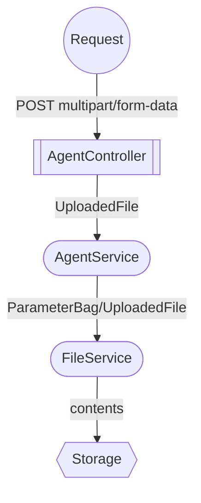

# Decisões Técnicas - Backend

Em alguns momentos durante o desenvolvimento precisamos 
## Upload de Arquivos

Para upload de arquivos estamos usando endpoints especificos, seguindo o padrão abaixo

```
POST /spaces/{id}/images

Content-Type: multipart/form-data
```

(até a tomada dessa decisão) O suporte da PHP para aceitar `multipart/form-data` só é possível via requisições do tipo `POST`.

O fluxo de envio da imagem passa por um único `Service`



## Enums apenas do lado do código
A motivação para não usar o tipo ENUM do proprio banco de dados se deu pois encontramos dificuldades com as migrations, mas, o mais importante:

**Preferimos manter as regras de negócio na camada da aplicação** ao invés de alocar isso no banco de dados.

A documentação dos Enums se encontra [aqui](./ENUM.md)