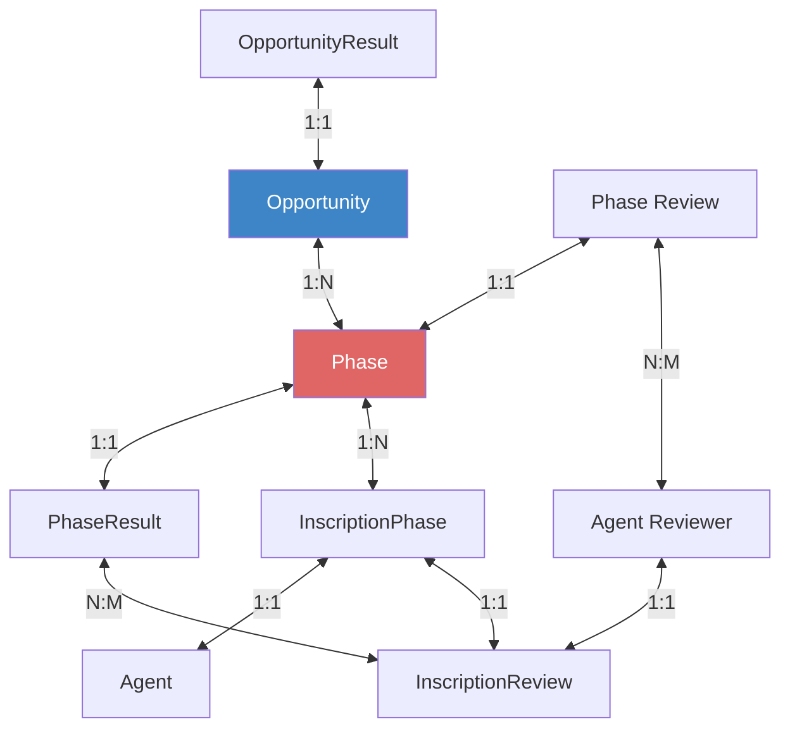

# Oportunidade

```mermaid
flowchart TD
    style P fill:#e06666, color:white
    style O fill:#3d85c6, color:white

    O[Opportunity] <--1:N--> P[Phase]
    P <--1:1--> R[PhaseResult]
    P <--1:N--> I[InscriptionPhase]
    I <--1:1--> A[Agent]
    PR[Phase Review] <--1:1--> P
    PR <--N:M--> AR[Agent Reviewer]
    AR <--1:1--> IR[InscriptionReview]
    I <--1:1--> IR
    R <--N:M--> IR
    OR[OpportunityResult] <--1:1--> O
```